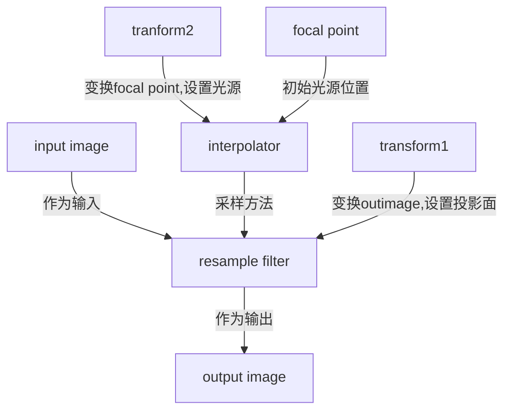

# 生成DRR的流程分析
 &nbsp;&nbsp;生成DRR主要的类是itkResampleImageFilter，itkInterpolateImageFunction以及transform  
 &nbsp;&nbsp;前者用于图像的采样，后者提供了采样的方法，而transform应该是有两个，transform1作为resample的输入，transform2作为interpolater的输入。transform1的作用是对输出图像位置进行变换，换一句话说，利用transform1可以设定DRR生成的所在平面，即拍摄X光的感光面。而transform2的作用是对focal point的位置进行变换。DRR的生成是由两个因素所决定的，即focal point的位置和感光面所在的位置。 

:::warning
关于在VTK中如何正确的放置图像，还存在讨论，另外如何能简便及准确的设置投影面还存在一些问题。
:::

